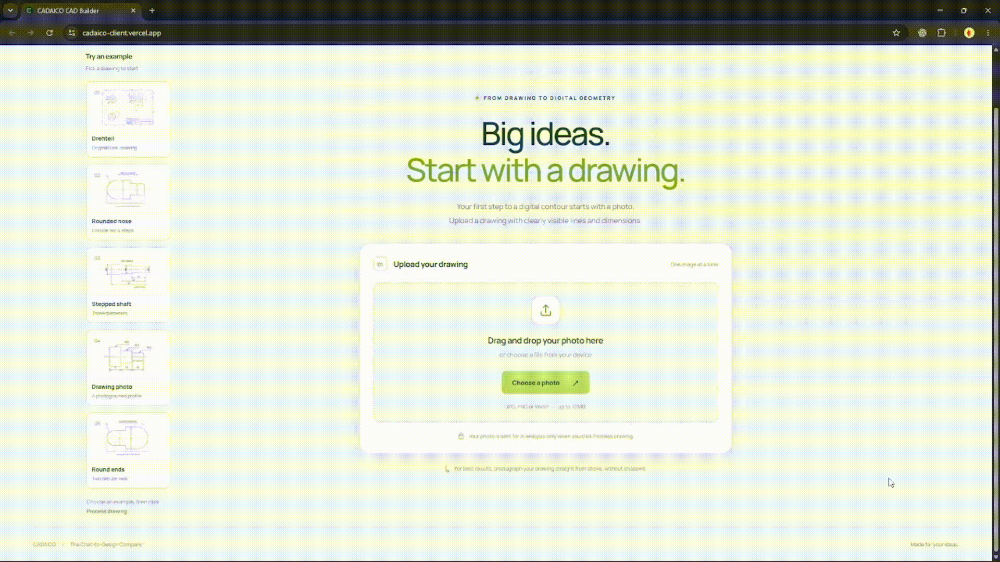

# CADAICO CAD Builder

Extract the outer contour of a technical drawing and export it as JSON and DXF for CAD.

**[Try the web app](https://cadaico-client.vercel.app/)** · [Frontend repository](https://github.com/EgorPichugin/CadaicoTestTaskFrontend)

Upload the original drawing without the yellow marking, inspect the contour and its 3D preview, then download the results.



## How it works

`Drawing → LLM extraction → Geometry calculation and validation → JSON + DXF`

The LLM reads dimensions and describes lines and arcs. A separate geometry service calculates coordinates from those constraints, mirrors the upper profile around the X axis, and checks that the contour is closed and has no self-intersections. The backend generates DXF using native line and arc entities in millimetres.

If a contour cannot be built, the app shows the reported issues, such as missing dimensions, uncertain readings or conflicting constraints. Results have one of four statuses: `Success`, `Unresolved`, `Ambiguous` or `Invalid`. DXF is produced only for `Success`; `Unresolved` means the current solver could not complete the calculation, not that no solution exists.

**Strength:** recognition and geometric calculation are separate, so extracted dimensions can be checked for consistency. **Limitation:** a misread dimension can still produce valid geometry. These checks do not guarantee recognition accuracy or manufacturing suitability.

## Current limits

- Only circular arcs and horizontal or vertical lines.
- Profiles symmetric about the X axis, with dimensions in millimetres.
- Internal holes and threads are excluded: the assignment asks for the outer contour highlighted in yellow.
- Missing data, unclear dimensions and solver limits can prevent a complete result.
- JPG, PNG or WebP input, up to 10 MB.

## Run locally without the API

Requires **Python 3.11+**, Git, an internet connection and an OpenAI API key with access to the configured model (`gpt-6-astra`). Recognition uses the OpenAI API even when running locally and incurs API usage charges.

In Windows PowerShell:

```powershell
git clone https://github.com/EgorPichugin/CadaicoTestTask.git
cd CadaicoTestTask
py -m venv .venv
.venv\Scripts\python.exe -m pip install -r requirements.txt
Copy-Item .env.example .env
```

Set `OPENAI_API_KEY=your-key` in `.env`, then run:

```powershell
.venv\Scripts\python.exe -m app.cli.process_drawing
```

A file picker opens. Choose a drawing. Results are saved next to it in `<image-name>_result/`:

- `extraction_result.json` — dimensions and contour structure read by the LLM.
- `geometry_result.json` — calculated geometry, status and issues.
- `contour.dxf` — CAD contour, created only on success.

For an incomplete or invalid geometry result, the JSON files contain the issues and no DXF is created. An input or recognition failure prints an error instead.

You can also pass a path and choose a new output folder:

```powershell
.venv\Scripts\python.exe -m app.cli.process_drawing "C:\drawings\part.jpg" --output results\part-01
```

The output folder must not already exist. If the file picker is unavailable, use the path option.

## Run the web service

After the same setup:

```powershell
.venv\Scripts\python.exe -m uvicorn app.main:app --reload --env-file .env
```

Open [API documentation](http://127.0.0.1:8000/docs), or follow the [frontend setup](https://github.com/EgorPichugin/CadaicoTestTaskFrontend#run-locally) to run the full web app locally.

`POST /api/v1/extractions` accepts the image in multipart field `file` and returns `{ "geometry": ..., "dxf": ... }`. The DXF value is file content on success, otherwise `null`. Check `geometry.status` and `geometry.issues`.

## Tests

```powershell
.venv\Scripts\python.exe -m pytest
```

Tests cover geometry calculation and validation, DXF export, API responses and local output files. Recognition is mocked; these tests do not measure accuracy on unseen drawings.

## TODO

- Add OCR and drawing-element detection (for example, YOLO) to cross-check dimensions and measure whether LLM reading errors decrease.
- Support inclined lines, chamfers and other segment types.
- Add background jobs, queues, retries for temporary failures, and fallback handling. The current pipeline is a prototype.
- Allow manual editing of points and lines, followed by geometry validation and updated exports.
